# UML диаграммы проекта
### 1.	Моделирование контекста системы и функциональных требований
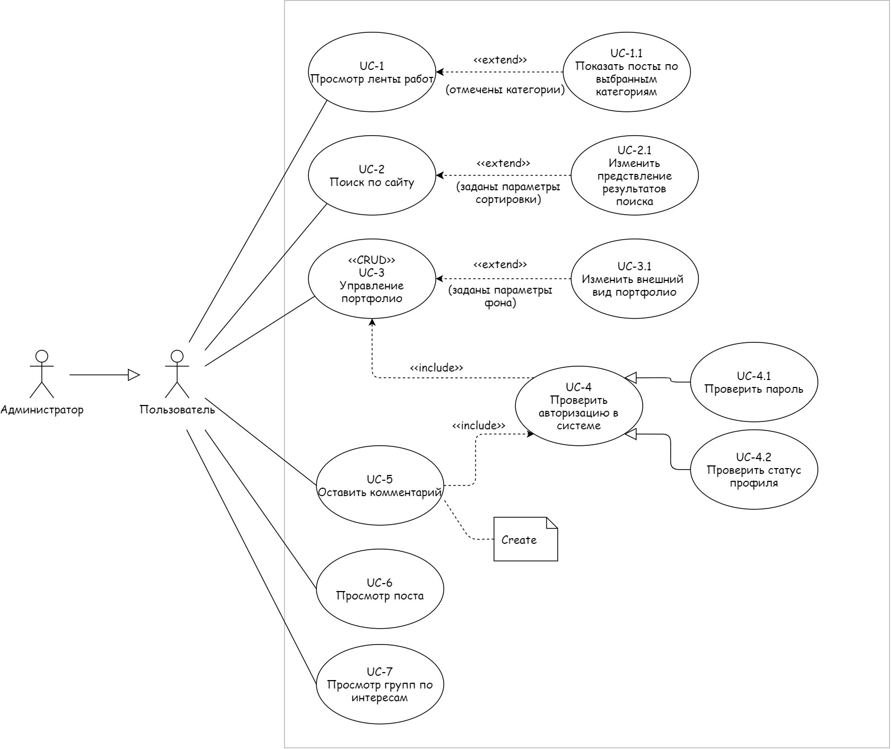
<h4 align="center">Рисунок 1 — Диаграмма вариантов использования для задач пользователя</h4> 

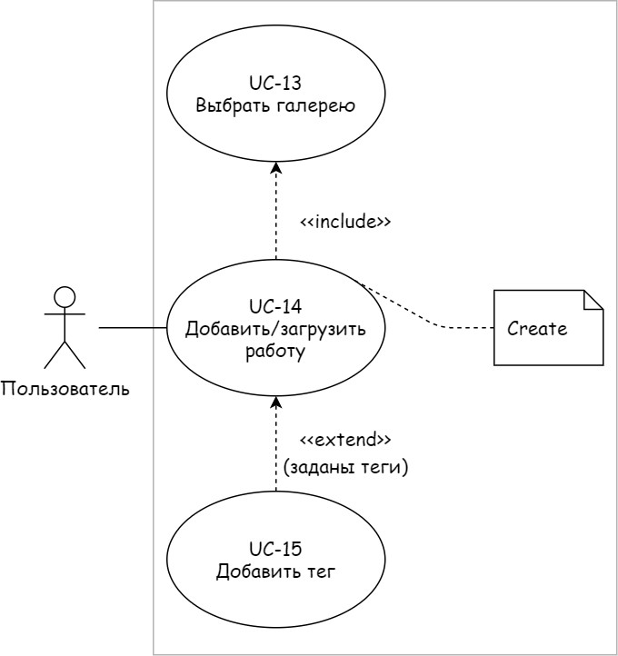
<h4 align="center">Рисунок 2 — Диаграмма вариантов использования для пользователя (дополнительно)</h4>

### 2.	Спецификация вариантов использования
<h4 align="right">Таблица 1 — ВИ «Оставить комментарий»</h4>

| **Идентификатор ВИ** | **UC-5** |
| :-------- | :------- |
| Наименование | Оставить комментарий |
| Автор | Гришкина Полина |
| Дата создания | 02.05.2024 |
| Основное действующее лицо | Пользователь |
| Дополнительное действующее лицо | - |
| Описание | Пользователь обращается к сайту, просматривает ленту постов, выбирает пост, который вызывает у него бурю эмоций, сдерживать которые невозможно, вследствие чего он решается оставить комментарий и, возможно, даже не один. |
| Приоритет | Средний |
| Условие-триггер | Пользователь выражает намерение поделиться мнением о работе посредством взаимодействия с элементом интерфейса «Оставить комментарий» |
| Предварительные условия | **PRE-1** Пользователь выполнил вход в систему (в противном случае будет доступен только просмотр комментариев от других пользователей). **PRE-2** Автор поста разрешил его комментирование. |
| Выходные условия | **POST-1** Комментарий сохранён в БД с идентифицирующим его постом   **POST-2** Обновленный список комментариев отображается под постом   **POST-3** Система отправляет уведомление автору о новом мнение насчет его работы |
| Основные потоки | **1.0** Оставить комментарий   1. Пользователь просматривает до конца пост   2. Система выводит пользователю комментарии других пользователей (Е2)  3. Около списка комментариев отображается элемент интерфейса «Оставить комментарий или редактировать (если их количество >=1)» (см.1.1), (Е1)  4. Пользователь взаимодействует с данным элементом, выбирая оставить комментарий.   5. Система предоставляет пользователю инструмент для написания отзыва  6. Пользователь записывает своё впечатление о работе  7. Пользователь ставит оценку посту  8. Пользователь нажимает на кнопку «Отправить»  9. Система добавляет отзыв пользователя в базу данных  10. Пользователь видит свой комментарий среди прочих  11. Система отправляет автору поста уведомление о новом комментарии под его работой |
| Альтернативные потоки | **1.1**	Редактировать комментарий (доступно в течение 10 минут) 1. Около оставленного пользователем комментария отображается элемент интерфейса «Редактировать комментарий»  2. Пользователь взаимодействует с этим элементом 3. Возврат к пункту 6 основного потока |
| Исключения | **Е1** Пользователь заблокирован модерацией  1.1 Пользователь не может оставлять отзывы  1.2 У пользователя не отображается элемент интерфейса «Оставить комментарий»  1.3 Завершение ВИ   **Е2** Автор поста запретил комментирование   1.1 Пользователь не может оставлять и просматривать отзывы  1.2 У пользователя не отображается элемент интерфейса «Оставить комментарий»  1.3 Завершение ВИ|
| Бизнес-правила | В рамках данной работы не заданы |
| Другая информация | Пользователь имеет возможность отредактировать или удалить свой комментарий |
| Предположения | - |

<h4 align="right">Таблица 2 — ВИ «Добавить работу»</h4>

| **Идентификатор ВИ** | **UC-14** |
| :-------- | :------- |
| Наименование | Добавить работу |
| Автор | Гришкина Полина |
| Дата создания | 03.05.2024 |
| Основное действующее лицо | Пользователь |
| Дополнительное действующее лицо | - |
| Описание | Пользователь обращается к сайту с целью добавления работы |
| Приоритет | Высокий |
| Условие-триггер | Пользователь выражает намерение поделиться своей работой с другими людьми посредством взаимодействия с элементом интерфейса «Добавить работу» |
| Предварительные условия | **PRE-1** Пользователь выполнил вход в систему. |
| Выходные условия | **POST-1** Работа сохранена в БД с идентифицирующим её тегом (если выбран) и галерей  **POST-2** Обновленный список работ отображается в профиле  **POST-3** Система отправляет уведомление друзьям пользователя (если они согласились получать их) о его новой работе |
| Основные потоки | **1.0** Добавить работу 1. Пользователь переходит в свой профиль 2. На странице отображается элемент интерфейса «Добавить работу»  3. Пользователь взаимодействует с данным элементом 4. Система предлагает пользователю способ добавления работы(drag and drop/проводник) (см. 1.1) 5. Пользователь перетаскивает выбранный файл в предоставленное окно 6. Система проверяет файл на корректность (Е1, Е2) 7. Пользователь выбирает галерею (если данный шаг пропускается, ставится галерея по умолчанию: "Общая") (см. 1.2) 8. Пользователю предлагается указать тег (по умолчанию тег отсутствует) (см. 1.3) 9. Пользователь добавляет к работе название и описание (по умолчанию поля пусты) (см. 1.4) 10. Пользователь нажимает на кнопку «Опубликовать работу»  11. Система добавляет работу пользователя в базу данных 12. Пользователь видит свою работу среди прочих в галерее 13. Система отправляет друзьям пользователя уведомление о его новой работе |
| Альтернативные потоки | **1.1** Добавление через проводник 1. Пользователь взаимодействует с элементом "Выбрать файл из проводника" 2. Пользователь выбирает файл с устройства 3. Возврат к пункту 6 основного потока  **1.2** Выбрать галерею 1. Пользователь взаимодействует с элементом "Выбрать галерею" 2. Пользователь перенаправляется на страницу с галереями 3. Система предоставляет выбор: создать галерею/выбрать существующую.  4. Пользователь выбирает новую (задаёт ей имя) либо уже существующую галерею 5. Возврат к пункту 8 основного потока  **1.3** Добавление тега 1. Пользователь взаимодействует с элементом "Добавить тег" 2. Пользователь выбирает тег из выпадающего списка  3. Возврат к пункту 9 основного потока  **1.4** Добавить наименование и описание  1. Пользователь взаимодействует с элементом "Добавить наименование и описание" 2. Пользователь вводит до 64 символов в окно с названием работы и до 256 - в окно с описанием 3. Возврат к пункту 10 основного потока |
| Исключения | **Е1** Пользователь загрузил файл с недопустимым расширением 1. Система выводит сообщение о некорректном расширении файла 2. Происходит сброс выбранного файла 3. Возврат к пункту 4 основного потока  **Е2** Пользователь загрузил файл размером более 25 Мб 1. Система выводит сообщение о превышении ограничения на размер файла 2. Происходит сброс выбранного файла 3. Возврат к пункту 4 основного потока |
| Бизнес-правила | В рамках данной работы не заданы |
| Другая информация | - |
| Предположения | - |

### 3.	Моделирование статического представления системы (фрагмент диаграммы классов)

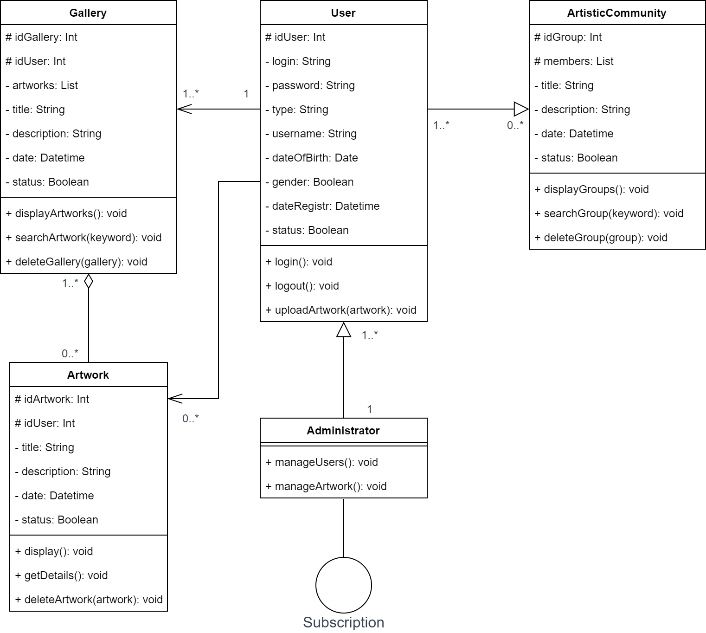
<h4 align="center">Рисунок 3 — Фрагмент диаграммы классов</h4>

### 4.	Моделирование потоков управления (диаграмма последовательности и диаграмма коммуникации)

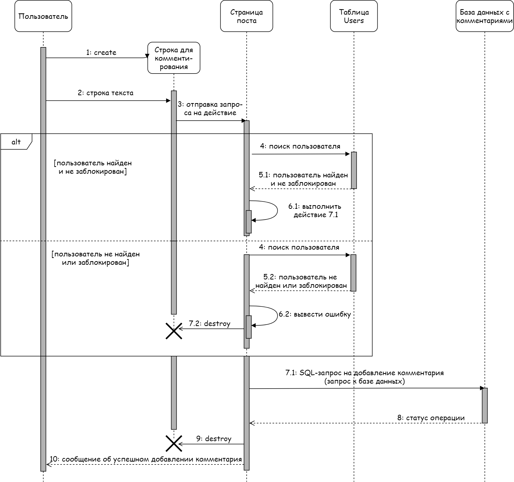
<h4 align="center">Рисунок 4 — Диаграмма последовательности для ВИ «Добавить комментарий»</h4>

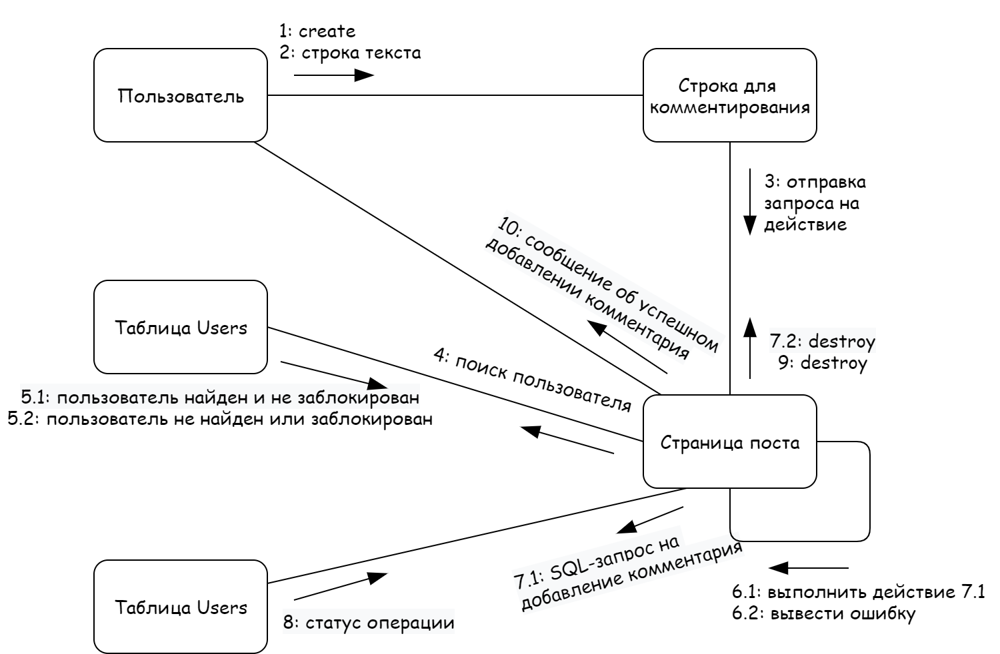
<h4 align="center">Рисунок 5 — Диаграмма коммуникации для ВИ «Добавить комментарий»</h4>

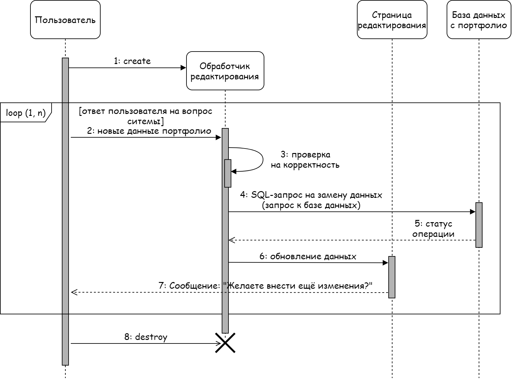
<h4 align="center">Рисунок 6 — Диаграмма последовательности для ВИ «Редактировать профиль»</h4>

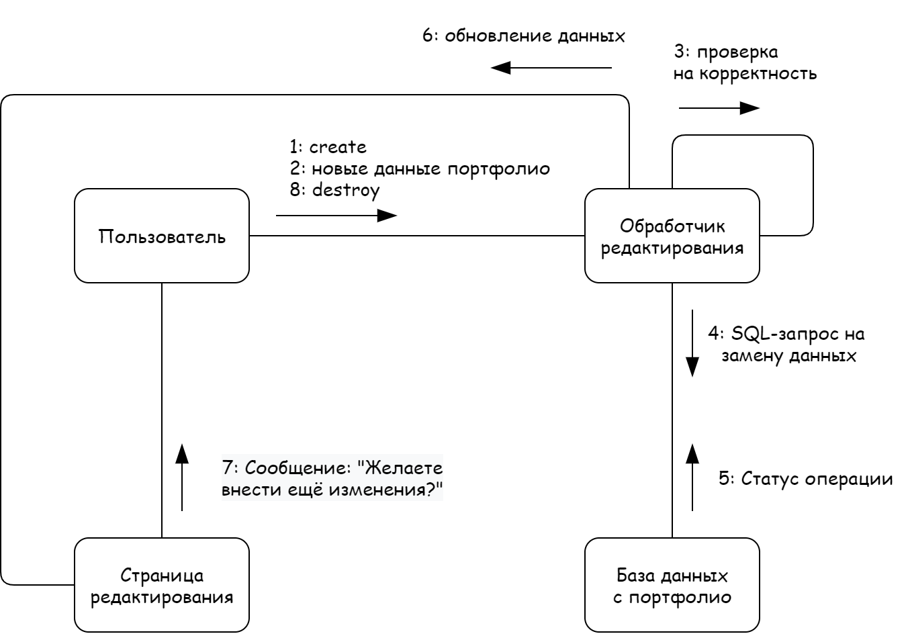
<h4 align="center">Рисунок 7 — Диаграмма коммуникации для ВИ «Редактировать профиль»</h4>

### 5.	Моделирование динамических аспектов систем (диаграмма деятельности)

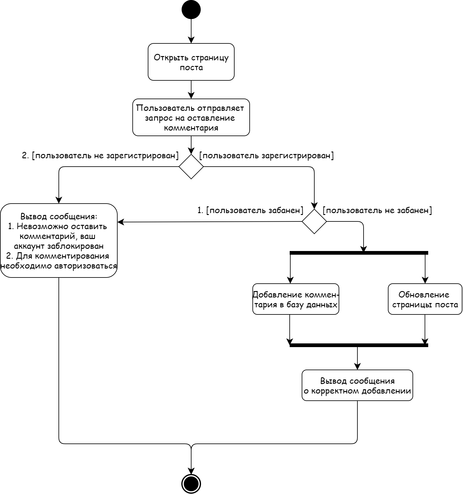
<h4 align="center">Рисунок 8 — Диаграмма деятельности для задач комментирования</h4>

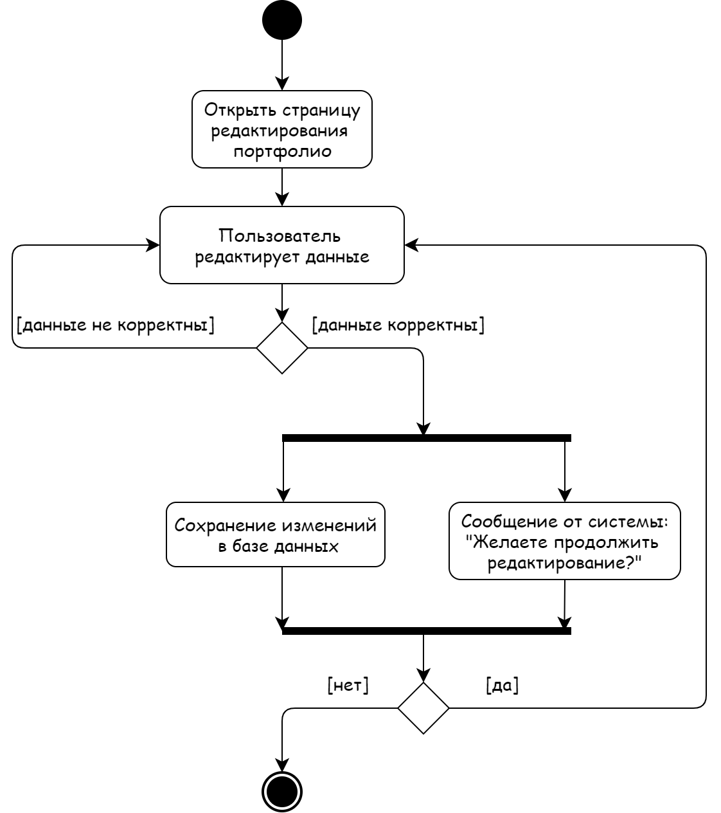
<h4 align="center">Рисунок 9 — Диаграмма деятельности для задач редактирования профиля</h4>

### 6.	Фрагмент навигационной карты пользовательского интерфейса

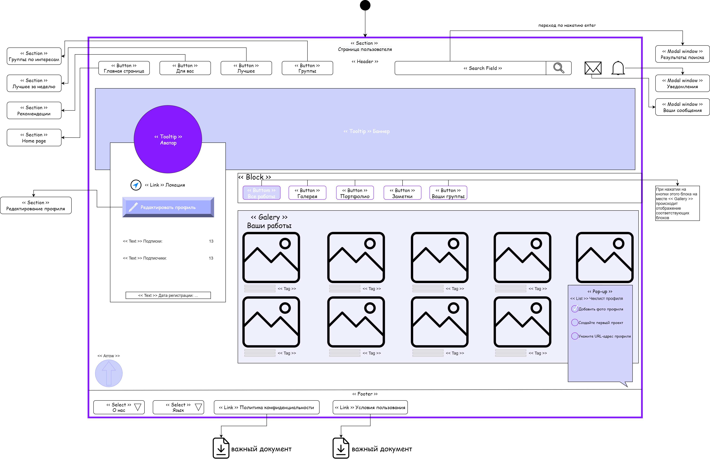
<h4 align="center">Рисунок 10 — Фрагмент навигационной карты относительно профиля пользователя</h4> 

### 7.	Логическая модель данных

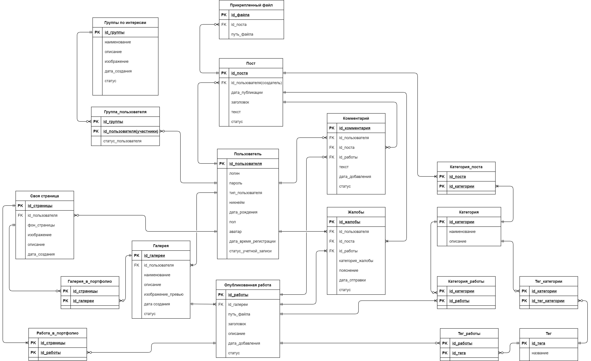
<h4 align="center">Рисунок 11 — Логическая модель данных в виде ER-диаграммы</h4> 
